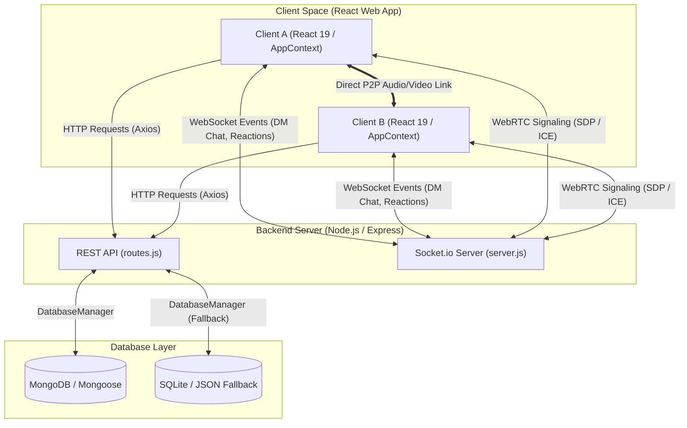

# 🎯 GoalMate — Dynamic Peer Accountability Platform

GoalMate is a state-of-the-art, high-fidelity peer accountability application designed to help partners stay locked-in, sync priorities, and crush goals together. Featuring vibrant dark-mode aesthetics, premium glassmorphism, real-time Socket.io signaling, and WebRTC peer-to-peer calling, GoalMate gamifies personal growth to make daily collaboration engaging and highly visual.

### 🌐 [Live Demo → goalmate-nk1d.onrender.com](https://goalmate-nk1d.onrender.com)

[](https://react.dev/)
[](https://vite.dev/)
[](https://nodejs.org/)
[](https://expressjs.com/)
[](https://www.mongodb.com/)
[](https://www.sqlite.org/)
[](https://socket.io/)
[](https://webrtc.org/)
[](https://jwt.io/)
[](https://render.com/)

---

## 🚀 Key Features

### 1. 💬 Advanced P2P Team Chat & Accountability Workspace
* **Optimistic UI with Deduplication**: Chat input submission is optimized with a 200ms debounce guard. Sent messages render instantly and are deduplicated seamlessly when server confirmation IDs return.
* **Interactive Goal-Sharing Cards**: Select any active focus goal from your list to display a beautiful card in the chat. Partners can click **"Cheer 🌟"** to send immediate toast encouragement.
* **Hover Emoji Reactions**: Hovering over message bubbles opens a glassmorphic reaction bar (👍, 🔥, 🚀, 🎯, 👏) that syncs instantly via WebSockets.
* **Suggested Response Pills**: Single-click suggested responses float above the input bar to quickly share states (e.g., *"Locked in and focused 🎯"*, *"Crushing goals today! 🔥"*).
* **Base64 Visual Snapshots**: Attach image/screenshot proof under **1.5MB** directly from your device, processed as compressed Data URIs and displayed inline.
* **Read Receipt Checkmarks**: Renders single checkmarks `✓` for sent, double grey checks `✓✓` for delivered, and double cyan checks `✓✓` for read status.
* **WhatsApp-Style Profile Sidebar**: Toggle a persistent right-side information panel loaded with your partner's streak badges, Level/XP progression, and active focus objectives. Fits perfectly on desktop viewports and slides away dynamically.

### 2. 📞 Premium WebRTC Voice & Video Calling
* **Audio & Video P2P Streaming**: Connect live with your partner via high-performance WebRTC streams. Video calls load a large remote viewport and a floating PIP panel for local feeds.
* **Animated Soundwave Visualizer**: Fallback animation featuring 9 staggered, bouncing bars that scale with keyframes for audio-only and hardware-restricted calling states.
* **Hardware Simulation Mode**: Automatically detects missing camera/microphone inputs or blocked permissions to gracefully run call simulations with custom status badges.
* **Ringing & Active Overlays**: Visual rings pulse outward from caller avatars (`pulse-ring` animation) to indicate ringing, connecting, and active call statuses.

### 3. 🏅 Decoupled Shared Tasks & Trophy Celebrations
* **Collaborative Task Assignment**: Assign tasks to yourself (`You`) or to both you and your partner (`Both:FriendName`).
* **Decoupled Progress**: One partner checking off a shared task does not mark it complete for the other. Each works at their own pace.
* **Trophy crowning**: The first partner to complete the task is crowned the winner, stamping their name under a gold-bordered trophy banner.
* **Live Sync Celebrations**: Completing a shared task triggers real-time socket celebrations on your partner's dashboard with sound/toast notifications.

### 4. 📅 IST Date Standardization & Expiring Focus Tasks
* **TimeZone Synchronization**: Date logic (like "Today's Focus" and "Tomorrow's Prep") is locked to **Indian Standard Time (IST, UTC+5:30)**, avoiding typical day-shift offsets.
* **Real-Time Expiry Countdowns**: Tasks have end-time constraints. Active countdown timers tick down to the second in the details modal.
* **OS-Level Device Notifications**: Socket-based assignments trigger native HTML5 browser push alerts even when GoalMate is minimized.
* **Interactive Start/End Editors**: Easily modify target times with inline form fields that auto-calculate estimated durations (e.g. *"1 hr 15 mins"*).

### 5. 💼 Career Tracker & Reflections Journal
* **Internship & Career Board**: Track jobs/internships with custom metadata tags (Applied Date, Target Start/End dates) and log progress stages.
* **Inline Date Configurator**: Modify target dates inside expanded job cards with custom-styled calendar triggers.
* **Reflections Journal**: Maintain private or shared daily logs with interactive mood emojis, saved directly to the database.

---

## 🛠️ Tech Stack

* **Frontend**:
  - React 19 (Hooks, Context API, Refs)
  - Vite 8 (Hot Module Replacement)
  - Lucide React (Icons)
  - Socket.io Client (Real-time gateway)
  - Custom Vanilla CSS (Dark mode, HSL tailored variables, glassmorphism, responsive grid layouts)
* **Backend**:
  - Node.js & Express (REST APIs & WebSocket routing)
  - Mongoose & MongoDB (Primary Database Layer with UUID primary keys)
  - Socket.io (WebSocket event server)
  - JSON & SQLite drivers (Built-in modular fallback engine)
  - BcryptJS & JSON Web Tokens (User authentication)

---

## 📐 System Architecture

GoalMate utilizes a decoupled client-server architecture built on top of high-performance real-time WebSocket events and Peer-to-Peer connection frameworks.



### Core Architecture Components

1. **Client (React Web App)**: Driven by React 19 and custom HSL-styled glassmorphic components. It relies on a centralized `AppContext` to handle state synchronization, WebSocket event listeners, and WebRTC media streams (camera/mic feeds).
2. **REST API (Express)**: Exposes endpoints for standard CRUD actions like user profile creation, authenticated sessions (via JWT), retrieving streaks/leaderboard status, and managing career board entries.
3. **Socket.io Signaling Server**: Serves as the real-time event hub. Beyond syncing DM chat messages, reaction emojis, read-receipt checkmarks, and cheer indicators, it brokers WebRTC peer handshakes by exchanging SDP offers, SDP answers, and ICE candidate events.
4. **WebRTC Peer-to-Peer Channel**: Enables direct, encrypted peer-to-peer browser streams for calling, bypassing backend media processing and offering ultra-low latency audio/video feeds.
5. **Database Abstraction Engine**: Abstracted behind a unified `DatabaseManager` in `db.js`. While MongoDB (Mongoose schemas) serves as the primary data store, it dynamically routes to local SQLite or local file fallbacks to guarantee uptime and offline portability during development.

---

## 📂 Project Structure

```bash
Goalmate/
├── dist/                   # Compiled production web assets
├── public/                 # Static assets (favicons, manifest)
├── server/                 # Express backend server
│   ├── check_mongo.js      # Database health-check diagnostic script
│   ├── db.js               # DatabaseManager & Mongoose Schemas definition
│   ├── routes.js           # REST API endpoints & route handlers
│   ├── server.js           # Main Express server & Socket.io pipeline initialization
│   └── package.json        # Backend dependencies & script configuration
├── src/                    # Frontend source files
│   ├── components/         # Shared React layout components
│   │   ├── AnalyticsView.jsx     # Dynamic task analytics & completed counters
│   │   ├── CallOverlay.jsx       # WebRTC calling viewport & PiP control panel
│   │   ├── ChatView.jsx          # Live DM Chat, search, reactions & sidebars
│   │   ├── DashboardView.jsx     # Expiring tasks, acceptance banners & task forms
│   │   ├── FriendsView.jsx       # Accountability Hub & Streak Leaderboard
│   │   ├── JournalView.jsx       # Mood Journaling & shared diary logger
│   │   ├── ProfileView.jsx       # Custom Base64 avatar uploader & credentials
│   │   └── TrackerView.jsx       # Career & Internship tracker boards
│   ├── context/            # React Global State
│   │   └── AppContext.jsx        # Socket event listeners, WebRTC hooks & state actions
│   ├── services/           # Axios-based API client mapping
│   │   └── api.js                # Core communication mapping with Express REST endpoints
│   ├── App.css             # Main component layout classes
│   ├── App.jsx             # Shell wrapper routing dashboards & login forms
│   ├── index.css           # Core styling tokens, animations, HSL variables & typography
│   ├── main.jsx            # React root mount script
│   └── vite.config.js      # Bundler settings
├── index.html              # HTML shell entrypoint
├── package.json            # Client configuration, build scripts, client dependencies
└── README.md               # Main project documentation
```

---

## ⚙️ Installation & Setup

Follow these steps to run GoalMate locally:

### 1. Prerequisites
Ensure you have the following installed:
* [Node.js](https://nodejs.org/) (version 18+ recommended)
* [MongoDB Community Server](https://www.mongodb.com/try/download/community) running locally on the default port `27017`.

### 2. Clone the Repository
```bash
git clone https://github.com/Prudhvi2206/GoalMate.git
cd GoalMate
```

### 3. Install Dependencies
Run the install command in the root folder (for Vite client dependencies) and in the `server` folder (for Express/Mongoose backend dependencies):

```bash
# Install root client dependencies
npm install

# Install server backend dependencies
cd server
npm install
cd ..
```

### 4. Database Seeding
GoalMate has an automated seeding routine. On the first server connection, if the MongoDB database `goalmate` is empty, it will automatically populate:
* Default users (`sarah`, `alex`, `marcus`) with hashed passwords.
* Initial active and completed tasks.
* Friendship mappings and default feeds.

### 5. Running the Application
Use `concurrently` (included in package.json) to start both the Vite dev server and the backend Express server concurrently with a single command from the project root:

```bash
npm run dev
```

* **Vite Web Client**: running on `http://localhost:5173`
* **Express & Socket Server**: running on `http://localhost:5000`

---

## 🧪 Verification & Development Commands

* **Compile Client Assets**: `npm run build`
* **Preview Client Bundle**: `npm run preview`
* **Format & Lint**: `npm run lint`

---

## 🎨 Design System & Aesthetics
GoalMate follows premium modern UI design guidelines:
* **harmonious HSL Gradients**: Deep dark blues and navy backgrounds (`#080c16`, `#0d1423`) combined with cyan, violet, and orange accent glow effects.
* **Glassmorphic Panels**: High backdrop blur (`backdrop-filter: blur(16px)`) mixed with semi-transparent white/grey borders (`rgba(255, 255, 255, 0.08)`).
* **Feedback micro-animations**: Focus inputs expand smoothly, checkmark tags pulse upon state updates, and soundwaves animate during voice calls.
